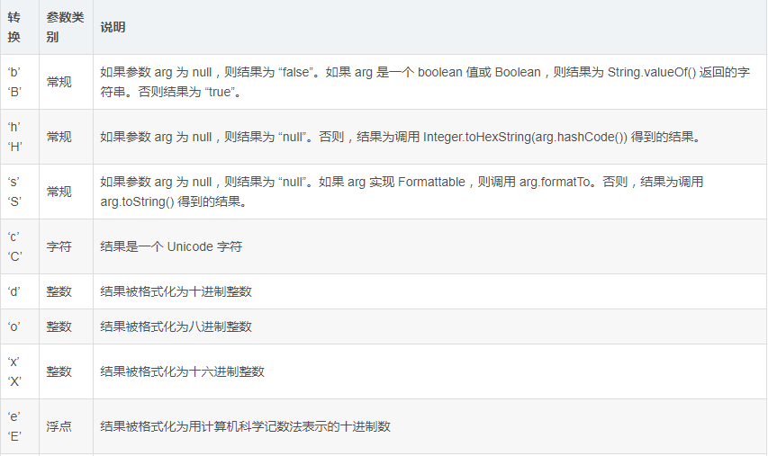

# 最佳实践
## java语言
### 1. 字符串格式化显示

java.lang.String.format()

该方法有两种重载形式：

一、format(String format,Object... args)
1. 使用本地语言环境

二、format(Locate locate,String format,Object... args)
1. 使用指定语言环境

两者都是使用Formater(location).format(format,args).toString()方法来实现字符串的格式化。

java.util.Formater.format()

结构模型

%[argument_index$][flags][width][.precision]conversion                     
eg:("%4$2s %3$2s %2$2s %1$2s","a","b","c","d")-> d c b a           
参数说明:                                                            
argument_index: 参数索引 
flags：可选属性 
 
width：字符站位宽度 
.precision:小数点位数 
conversion:格式转换 

 
### 2. 金额计算

## 集合

## 线程

## 事务

## 数据库

## spring

## 算法
